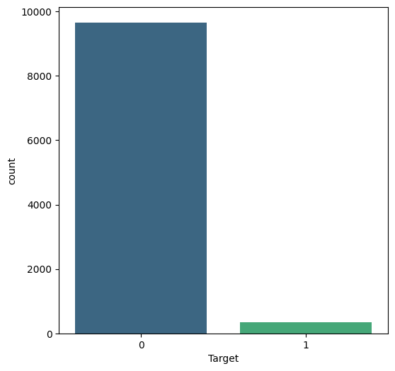
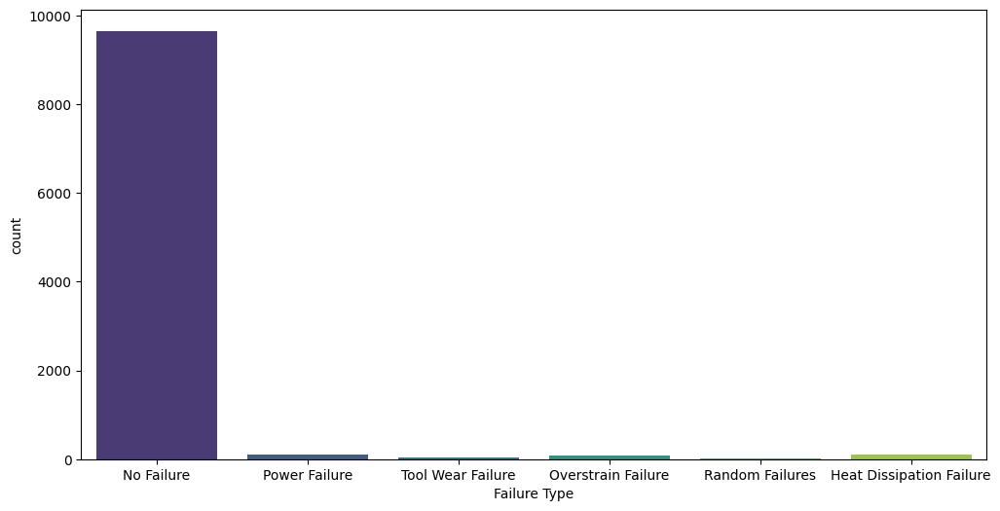
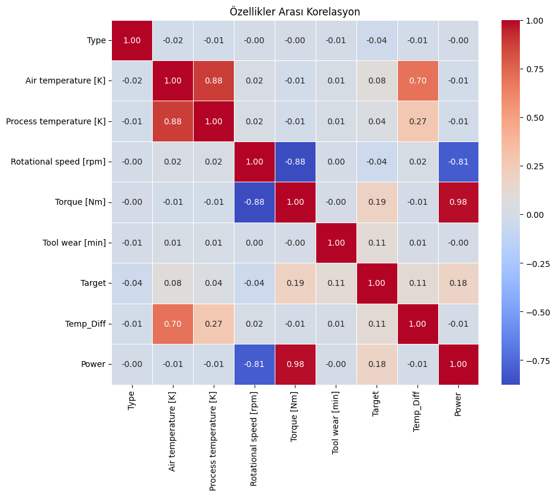
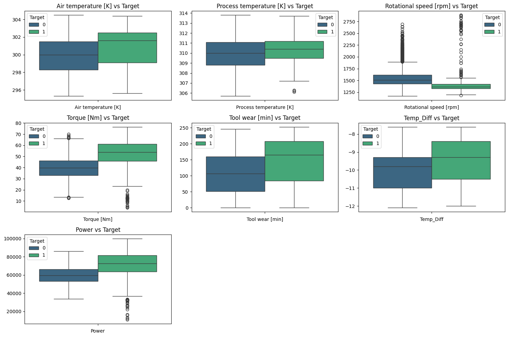
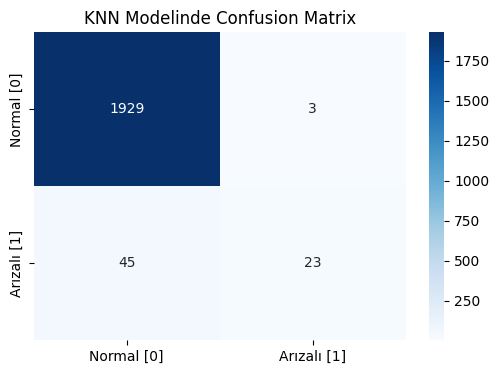
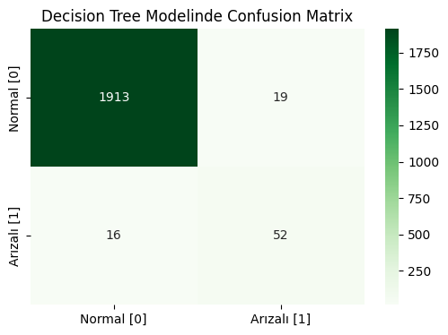
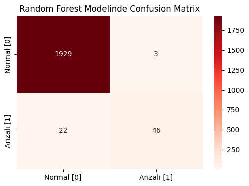
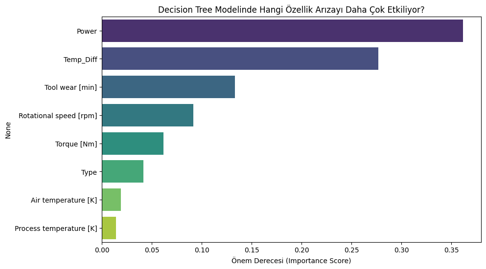
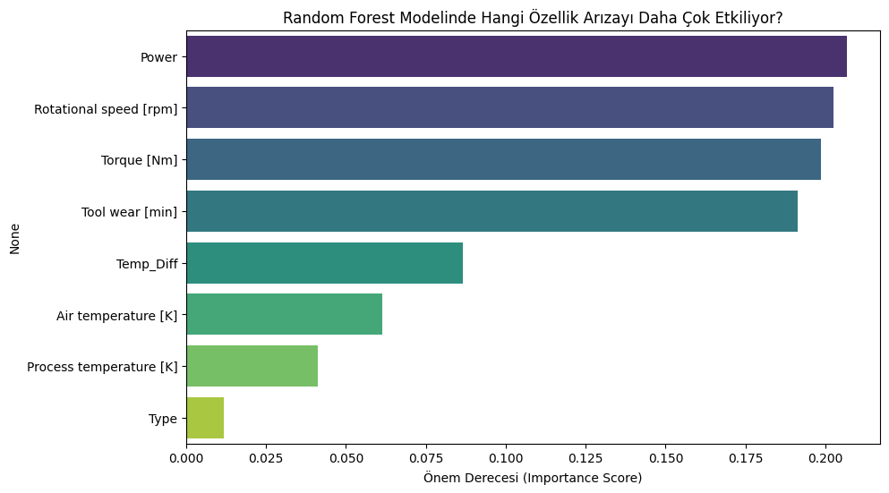

# 🛠️ Predictive Maintenance Modeling / Kestirimci Bakım Modellemesi

[🇹🇷 Türkçe Açıklama İçin Tıklayın](#-proje-hakkında) | [🇬🇧 Click for English Description](#-about-the-project)

---

## 🇹🇷 Proje Hakkında

Bu proje, makine sensör verilerini kullanarak olası ekipman arızalarını önceden tahmin etmeyi amaçlayan bir makine öğrenmesi uygulamasıdır. **Kestirimci bakım (Predictive Maintenance)**, endüstride maliyetli duruş sürelerini önlemek için kritik bir öneme sahiptir.

Bu çalışmada, **KNN (K-Nearest Neighbors)**, **Decision Tree (Karar Ağacı)** ve **Random Forest (Rastgele Orman)** algoritmaları kullanılarak sınıflandırma modelleri geliştirilmiştir. Ayrıca veri seti üzerinde özellik mühendisliği (Feature Engineering) yapılarak model başarısı artırılmaya çalışılmıştır.

### ⚠️ Kritik Detay: Veri Dengesizliği (Class Imbalance)
Bu projenin en zorlu ve önemli yönü veri setinin doğasıdır. Veri seti **aşırı dengesiz (imbalanced)** bir yapıdadır.
* **Normal İşleyiş (0):** %97
* **Arıza Durumu (1):** %3

Bu dengesizlik nedeniyle, modellerin başarısını ölçerken sadece **Accuracy (Doğruluk)** değerine bakmak yanıltıcı olabilir. Bu yüzden, arızaları yakalama yeteneğimizi gösteren **Recall (Duyarlılık)** ve **F1-Score** metrikleri üzerinde özellikle durulmuştur.

### ⚙️ Kullanılan Teknikler ve Ön İşleme
1.  **Veri Temizleme:** Gereksiz ID sütunlarının (UDI, Product ID) çıkarılması.
2.  **Feature Engineering:**
    * `Temp_Diff`: Hava sıcaklığı ile proses sıcaklığı arasındaki fark.
    * `Power`: Tork ve Dönüş Hızının çarpımı ile elde edilen güç değeri.
3.  **Encoding:** Kategorik değişkenlerin (`Type`) sayısal verilere dönüştürülmesi.
4.  **Scaling:** Verilerin `StandardScaler` ile ölçeklendirilmesi (Özellikle KNN için kritik).

### 📊 Veri Görselleştirme ve Analiz (EDA)

Veri setini anlamak ve özellikler arasındaki ilişkileri görmek için yapılan analizler:

**1. Hedef Değişken Dağılımı:**
Veri setindeki dengesizliğin net bir göstergesi.

**2. Arıza Tiplerinin Dağılımı:**

**3. Korelasyon Matrisi:**
Özelliklerin birbirleriyle ve hedef değişkenle olan ilişkisi.

**4. Aykırı Değer Analizi (Boxplots):**

---

### 🚀 Model Performansları ve Sonuçlar

Veri setindeki dengesizlik göz önüne alındığında, modellerin **Recall (Arızayı Yakalama)** performansı kritiktir.

| Model | Accuracy (Genel Başarı) | Precision (Arıza-1) | Recall (Arıza-1) | F1-Score (Arıza-1) |
| :--- | :---: | :---: | :---: | :---: |
| **KNN** | 97.60% | 0.88 | 0.34 | 0.49 |
| **Decision Tree** | 98.25% | 0.73 | **0.76** | 0.75 |
| **Random Forest** | **98.75%** | **0.94** | 0.68 | **0.79** |

**Değerlendirme:**
* **KNN:** Yüksek genel doğruluğa sahip olsa da, arızaları tespit etmede (Recall: 0.34) oldukça başarısız kalmıştır. Dengesiz veri setlerinde mesafe temelli algoritmalar zorlanabilir.
* **Decision Tree:** Arızaları yakalamada (Recall: 0.76) en başarılı model olmuştur, ancak yanlış alarmları (Precision) Random Forest'a göre biraz daha fazladır.
* **Random Forest:** En yüksek F1-Score ve Accuracy değerine sahiptir. Dengeli bir performans sergilemiştir.

#### Karmaşıklık Matrisleri (Confusion Matrices)

| KNN | Decision Tree | Random Forest |
| :---: | :---: | :---: |
|  |  |  |

#### Özellik Önem Düzeyleri (Feature Importance)
Modellerin karar verirken en çok dikkat ettiği özellikler:

*Decision Tree Önem Düzeyleri:*

*Random Forest Önem Düzeyleri:*

---
---

## 🇬🇧 About the Project

This project is a machine learning application designed to predict potential equipment failures using sensor data. **Predictive Maintenance** is crucial in the industry to prevent costly downtimes.

In this study, classification models were developed using **KNN (K-Nearest Neighbors)**, **Decision Tree**, and **Random Forest** algorithms. Additionally, **Feature Engineering** was applied to the dataset to enhance model performance.

### ⚠️ Critical Detail: Class Imbalance
The most challenging and significant aspect of this project is the nature of the dataset. The dataset is **highly imbalanced**.
* **No Failure (0):** 97%
* **Failure (1):** 3%

Due to this imbalance, relying solely on **Accuracy** metrics can be misleading. Therefore, special emphasis was placed on **Recall** (ability to catch failures) and **F1-Score** metrics during evaluation.

### ⚙️ Techniques & Preprocessing
1.  **Data Cleaning:** Removal of irrelevant ID columns (UDI, Product ID).
2.  **Feature Engineering:**
    * `Temp_Diff`: The difference between air temperature and process temperature.
    * `Power`: Derived by multiplying Torque and Rotational Speed.
3.  **Encoding:** Converting categorical variables (`Type`) into numerical formats.
4.  **Scaling:** Scaling data using `StandardScaler` (Critical for distance-based algorithms like KNN).

### 📊 Exploratory Data Analysis (EDA)

Visualizations created to understand the dataset and feature relationships:

**1. Target Variable Distribution:**
A clear indicator of the class imbalance.

**2. Distribution of Failure Types:**

**3. Correlation Matrix:**
Relationships between features and the target variable.

**4. Outlier Analysis (Boxplots):**

---

### 🚀 Model Performances & Results

Considering the imbalance in the dataset, the **Recall** performance of the models is critical.

| Model | Accuracy | Precision (Class 1) | Recall (Class 1) | F1-Score (Class 1) |
| :--- | :---: | :---: | :---: | :---: |
| **KNN** | 97.60% | 0.88 | 0.34 | 0.49 |
| **Decision Tree** | 98.25% | 0.73 | **0.76** | 0.75 |
| **Random Forest** | **98.75%** | **0.94** | 0.68 | **0.79** |

**Evaluation:**
* **KNN:** Although it has high accuracy, it failed significantly in detecting failures (Recall: 0.34).
* **Decision Tree:** It was the most successful model in capturing failures (Recall: 0.76), though it produced slightly more false positives compared to Random Forest.
* **Random Forest:** Achieved the highest F1-Score and Accuracy, demonstrating a balanced performance.

#### Confusion Matrices

| KNN | Decision Tree | Random Forest |
| :---: | :---: | :---: |
|  |  |  |

#### Feature Importance
The most significant features used by the models for decision making:

*Decision Tree Feature Importance:*

*Random Forest Feature Importance:*

---

## 🔗 Contact / İletişim

**Developer:** [Furkan İZMİR]  

*(Click the badge above to visit my profile)*
